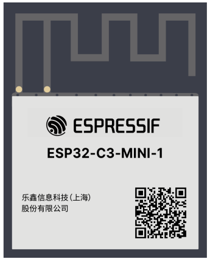

## July 22

### Component Selection & Schematic

I looked at options for ESP32 modules. I am opting to use a module rather than a bare chip due to the additional component cost, reliability benefits and ability to better avoid PCBA. As devboards are intended for quick iteration and easy integration, I want to avoid any design decisions that will decrease reliability or ease of implementation.

My main focus is on the C series processors due to the lower power consumption for a wide range of features. Looking at the differences between the C3 & C6, I opted to proceed with a ESP32-C3-MINI for the smaller footprint and lower power consumption.

When deciding the footprint and scope of the board, my main design requirements are maintaining a small footprint, exposing the full feature set of the C6-Mini, and having a positive user experience. From the UX aspect of things, this means features such as status LEDs, and an inbuilt RGB LED for user control.

**Total time spent 1h**
